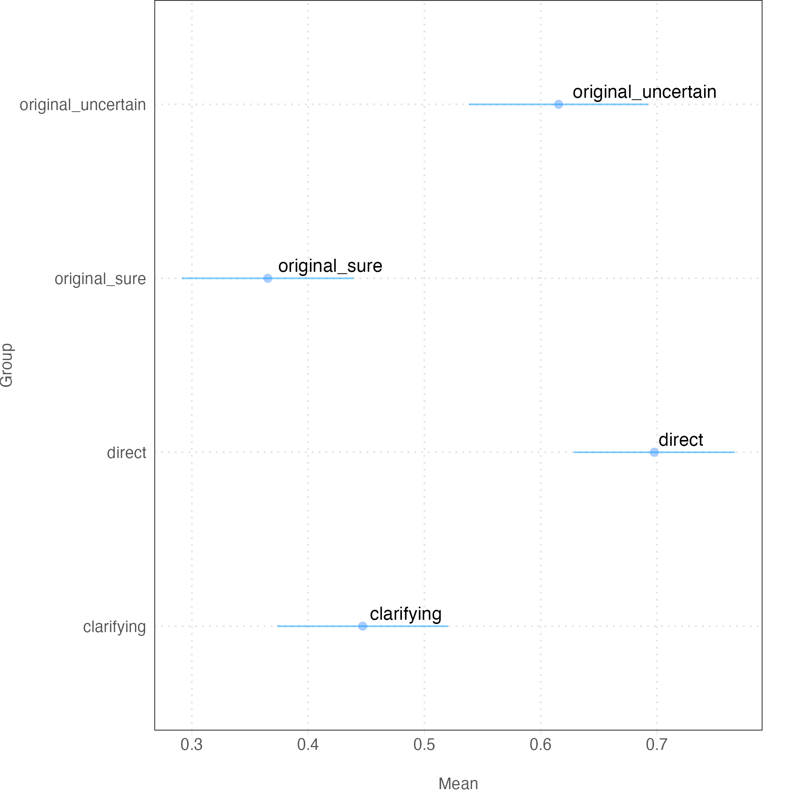

### Is an Uncertain Prospect Less Preferred Than Its Worst Possible Outcome? New Evidence on the Uncertainty Effect

In a seminal article in the Quarterly Journal of Economics, Gneezy, List, and Wu (GLW) report the discovery of the uncertainty effect. In a series of experiments, they find that people are averse to picking the uncertain option even when the certain choice is worse than the worst possible outcome of the uncertain option. We successfully replicate the main finding with two larger, more representative surveys. But our data also suggest three qualifiers: 1. Adding clarifying text about the worst case to the uncertain option closes the gap, 2. Numeracy strongly predicts who chooses the worse option, 3. Providing bonus flips the sign of the effect.

### Data

* [Lucid](data/lucid/)
* [Prolific](data/prolific)

### Scripts

* [Scripts](scripts/)

### Manuscripts

* [Manuscript](ms/)

### Authors

Doug Ahler and Gaurav Sood
