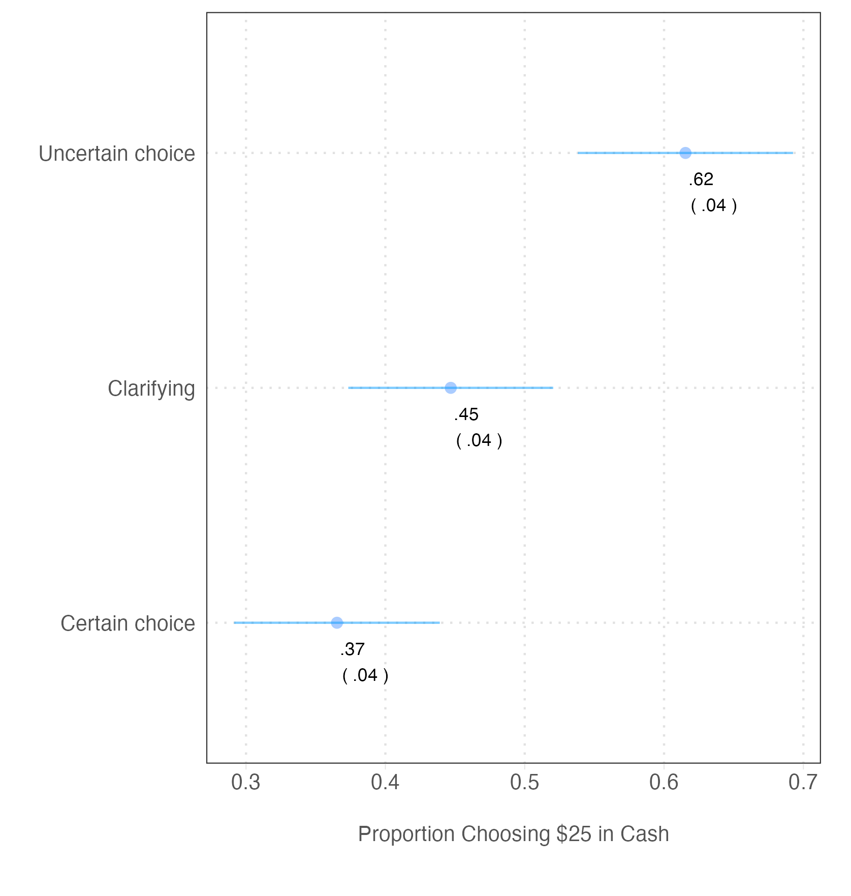

### Is an Uncertain Prospect Less Preferred Than Its Worst Possible Outcome? New Evidence on the Uncertainty Effect

In a seminal article in the Quarterly Journal of Economics, Gneezy, List, and Wu report the discovery of the uncertainty effect. In a series of experiments, the authors find that people are averse to picking the uncertain option even when the certain choice is worse than the worst possible outcome of the uncertain option. We successfully replicate the main finding with two larger, more representative surveys. But our data suggest three qualifiers: 1. adding a phrase that clarifies that people are guaranteed to get at least the worst option or asking people to estimate the expected value of the uncertain option before choosing reduces the effect, 2. rephrasing the uncertain option in terms of natural frequencies undoes the effect, and 3. redoing the experiment with monetary choices also undoes the effect.

### Data

* [Lucid](data/lucid/)
* [Prolific](data/prolific)

### Scripts

* [Scripts](scripts/)

### Manuscripts

* [Manuscript](ms/)

### Authors

Doug Ahler and Gaurav Sood
